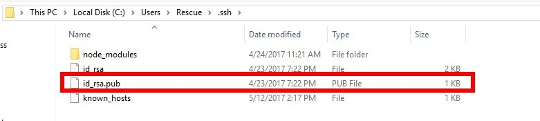
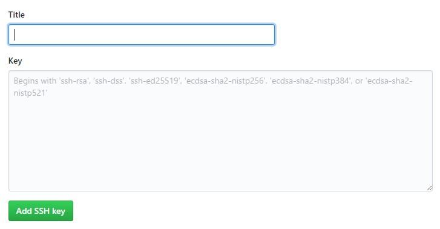

##GitPage教程：

###1. 安装git并进行设置：
设置user.name和user.email配置信息：
``` bash
git config --global user.name "你的GitHub用户名"
git config --global user.email "你的GitHub注册邮箱"
``` 
生成ssh密钥文件：
``` bash
ssh-keygen -t rsa -C "你的GitHub注册邮箱"
``` 
然后直接三个回车即可，默认不需要设置密码
然后找到生成的.ssh的文件夹中的id_rsa.pub密钥，将内容全部复制

打开GitHub_Settings_keys 页面，新建new SSH Key


###2.创建GitHub GitPage
点击GitHub中的New repository创建新仓库，仓库名应该为：用户名.http://github.io 这个用户名使用你的GitHub帐号名称代替，这是固定写法.

##hexo教程：
###hexo概述：
Welcome to [Hexo](https://hexo.io/)! This is your very first post. Check [documentation](https://hexo.io/docs/) for more info. If you get any problems when using Hexo, you can find the answer in [troubleshooting](https://hexo.io/docs/troubleshooting.html) or you can ask me on [GitHub](https://github.com/hexojs/hexo/issues).

## Quick Start

###安装软件与准备工作：

安装nodejs，hexo：
使用npm命令安装Hexo，输入：
``` bash
npm install -g hexo-cli
```
安装hexo deploy插件
``` bash
$ npm install hexo-deployer-git --save
```
初始化博客：
``` bash
hexo init blog
```
### Create a new post
生成md文档：
``` bash
$ hexo new "My New Post"
```
简写：hexo n
More info: [Writing](https://hexo.io/docs/writing.html)

### Run server
启动服务器：
``` bash
$ hexo server
```
简写：hexo s
More info: [Server](https://hexo.io/docs/server.html)

### Generate static files
清理之前的文章网页：
``` bash
$ hexo clean
```
生成网页
``` bash
$ hexo generate
```
简写：hexo g
More info: [Generating](https://hexo.io/docs/generating.html)

### Deploy to remote sites
文章发布：
``` bash
$ hexo deploy
```
简写：hexo d
More info: [Deployment](https://hexo.io/docs/one-command-deployment.html)

##我的博客：

访问地址：
https://mei5436.github.io/
博客代码：
https://github.com/mei5436/mybogs
